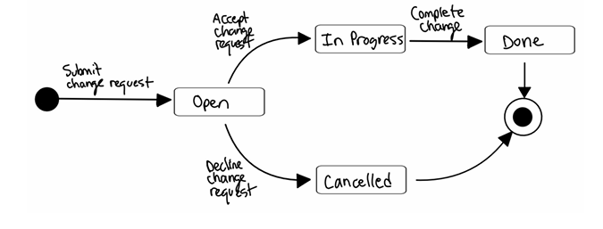

# 1.0: Introduction 
## 1.1: System Overview 
  The application area for this software is the tech/software industry, specifically for the 
software company 5 Software On Systems, or 5SOS for short. 5SOS will use our software to 
keep track of bugs and features to be added to their own products. There are several types of jobs 
within this application area, ranging from business related jobs such as marketing to people 
working tech jobs such as software engineers. This type of software is useful for all types of 
people working within the software industry. One of the more common issues being run into 
without this software is the issue of workflow and how much it could be improved by using this 
software. Without this software, companies commonly have actual sheets of paper that log things 
such as bugs and new features. Using paper can make it harder to stay organized, thus resulting 
in a slower workflow.

  We are introducing a system that keeps track of bugs, new features, and status updates all 
in one place. This system can be used by both customers via employees over the phone and 
internal employees to keep track of changes made (or needed to be made) to the company's 
products. On the customer side, customers can call in to report a bug they ran into, or to give 
suggestions for a feature they may find to be helpful in the future. An employee logs the 
information given to them by the customer, as well as the customer's contact information if it is 
their first time calling. Customer information is stored in a database for ease of access. Similarly, 
employees from any department can do the same thing. They are also able to keep track of what 
needs to be done and can provide status updates on certain features, for example, whether or not 
a bug has been fixed.  

The major functions of the system include: 
- The ability to log issues into the issue tracking software.
- The ability to view all issues that have been reported.
- The ability to edit an issue (provide a status update?)
- The ability to store customer and employee information in a database for ease of access 
in the future. 

As mentioned previously, we developed this to improve company productivity. The major 
functions available in this software allow users to quickly log whatever they find necessary to be 
addressed in a much quicker fashion than if they had to do it the old-fashioned way i.e. using pen 
and paper, which would eventually need to be organized. Because of the vast difference between 
the old and the new system, this software will greatly improve workflow within the application 
area by getting rid of some of the steps that occur between a complaint being issued and the 
employee responsible for fixing it. 

# 5.0: State (Control) Modes 
## 5.1: State Diagram 

## 5.2: State Discussion 
The lifecycle of a change request in the issue tracking system is shown through a state 
diagram consisting of four states: Open, In Progress, Cancelled, and Done. The process begins 
when a requester submits a change request. 

When a user submits a change request, the state of the request is automatically Open. 
Upon reviewing a change request, if it is declined, the state becomes Cancelled. This may occur 
if the request does not make sense, has already been handled in a different change request, or if it 
is determined upon further investigation to just be a user problem. If a change request is 
accepted, the change process will begin and the state of the request transition to be In Progress. 

Upon completion of the change, the state of the request will transition to Done, signifying 
that the requested change has been successfully implemented and finalized. The state of the 
request cannot be changed from the Cancelled or Done state. This structure ensures that every 
change request is systematically processed, either through completion or cancellation, and 
appropriately finalized. 

# 8.0: Software Prototype and Future Releases 
## 8.1: Current Release 
In the current release, we will include the main functionalities per the client’s request. 

These features include: 
- Report a bug
- Request a feature
- Status Update
- Exit 
We know for sure that these are the main functionalities that our client wants for their software.

## 8.2: Prototype 
The prototype will be a display menu with features that the user can choose.  
Features that will be included in the prototype are: 
- Report a bug
- Request a feature
- Status Update
- Exit
- Sales inquiry
- General query
- View status of submitted issues 
We are including the first four features because we know for sure they will be in the 
software and thus would be helpful to receive feedback about it from the client before releasing 
the actual software. The other three features, i.e. Sales inquiry, General query, and View status of 
submitted issues, are features that we think would be helpful for the software but are not 
completely sure about what the client thinks. Therefore, we include them in the prototype to 
receive clarification about them.

## 8.3: Future Releases 
Ideas for what we could include in a future release of the software include: 
- Separate tabs for viewing bugs and new features on different pages
- Separate tabs for bugs currently being worked on, bugs that have not been worked on, 
and bugs that are complete
- Different sorting options (i.e. sort by priority or sort by date, etc.)
- Web-based, and mobile version of the software
- Ability to have remote access of the software 

# 9.0: Acceptance Criteria 
## 9.1: Hard Requirements 
This software must meet all requirements listed in Section 7.0 of this document. 

## 9.2: Goals 
Through our software, 5SOS aims to achieve the following goals: 
- Increase productivity by at least 25%
- Receive customer and employee feedback on products more easily and in a more 
organized fashion

## 9.3: Acceptance Test Requirements 
The software will go through a process of testing and debugging by our quality assurance 
engineers before being handed to the client. The client should run a few tests as well before 
determining whether the deal will go through or if there is still more testing and fixing to be done 
by our engineers. Once testing has concluded, the business transaction will be complete, with the 
client paying us the $300,000 that was agreed upon in the business contract. 

*This Markdown file provides a condensed, recruiter-friendly overview. The full 42-page SRS PDF contains detailed requirements, diagrams, and additional sections.*
